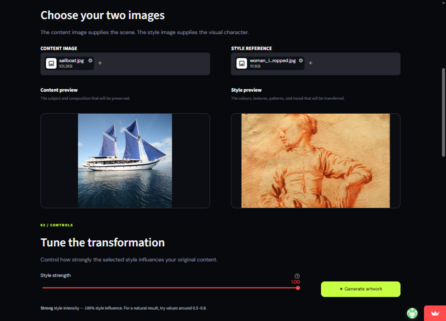
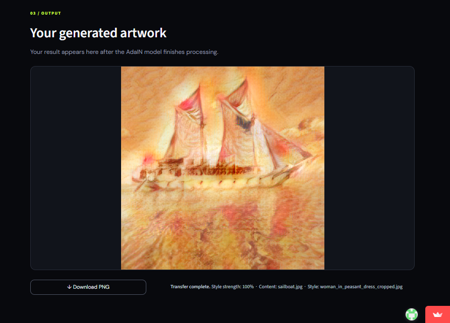
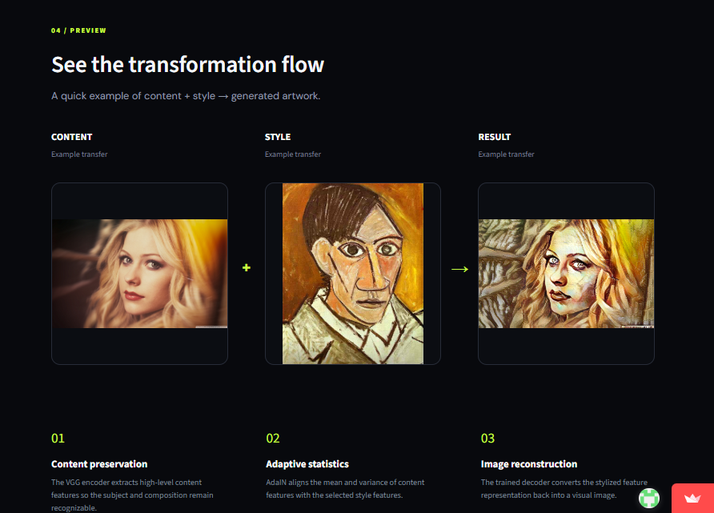

<div align="center">

# 🎨 CanvasAI — Neural Style Transfer

**A PyTorch implementation of Adaptive Instance Normalization (AdaIN) that blends the content of one image with the artistic style of another — served through a live Streamlit app.**

[](https://aicanvas.streamlit.app/)
[](https://www.python.org/)
[](https://pytorch.org/)
[](https://streamlit.io/)

</div>

---

## 🔒 About This Repository

This is a **showcase repository** for a private project. The full source code, trained model weights, and training pipeline live in a private repo. This page exists so recruiters and collaborators can see the project, try the live demo, and review how it works — without the source being publicly clonable.

> **📩 Want to see the code or run it yourself?**
> Send a request to **[Email](mailto:imjs1137@gmail.com)** or connect on **[LinkedIn]([https://aicanvas.streamlit.app/](https://in.linkedin.com/in/jatinsoni1137)** and I'll grant repo access.

---

## 📸 Preview

**Key screens:**

| Input | Output | Example |
|:---:|:---:|:---:|
|  |  |  |

**[🔗 Try the live demo →](https://aicanvas.streamlit.app/)**

---

## 💡 What It Does

CanvasAI takes two images — a **content** image (the structure/subject) and a **style** image (the colors/textures) — and merges them using a neural network technique called **Adaptive Instance Normalization (AdaIN)**. Unlike slower optimization-based style transfer, AdaIN performs the transfer in a single forward pass, making it fast enough for a responsive web interface.

## ⚙️ How It Works

1. A pre-trained **VGG encoder** extracts feature representations from both the content and style images.
2. **AdaIN** aligns the mean and variance of the content features to match the style features, transferring style statistics while preserving content structure.
3. A trained **decoder** network reconstructs the stylized image from these adapted features.
4. A **style strength slider** in the UI lets users blend between the original content and the fully stylized output.

## ✨ Features

- 🖼️ Upload any content + style image pair (PNG/JPG/JPEG)
- 🎚️ Adjustable style strength for fine control over the blend
- ⬇️ Download the generated image directly from the browser
- 🧠 Custom-trained AdaIN decoder (not just an off-the-shelf model)
- 🏋️ Full training pipeline included for retraining on custom datasets

## 🛠️ Tech Stack

| Category | Technology |
|---|---|
| Deep Learning | PyTorch, TorchVision |
| Model Architecture | VGG-19 encoder + custom AdaIN decoder |
| Web Interface | Streamlit |
| Image Processing | Pillow |

## 🗂️ Project Architecture (private repo)

```text
Code/
├── ui.py              # Streamlit user interface
├── train.py           # AdaIN decoder training script
├── utils/
│   ├── models.py      # VGG encoder and decoder definitions
│   └── utils.py       # Dataset, transforms, and AdaIN utilities
├── content_data/       # Sample content images
├── style_data/         # Sample style images
└── vgg_normalised.pth  # Pre-trained VGG encoder weights
```

## 🎯 Why I Built This

Most neural style transfer demos online are either painfully slow (iterative optimization per image) or black-box APIs where you can't see or tweak the underlying model. I wanted to build and train the actual AdaIN architecture from scratch — encoder, decoder, and the normalization math — end to end, and wrap it in an interface fast enough to actually experiment with in real time.

## 🧠 Technical Challenges & Decisions

- **Speed vs. quality tradeoff** — Iterative style transfer (Gatys et al.) produces great results but takes minutes per image. AdaIN's single-pass architecture trades a small amount of fidelity for near-instant inference, which was the right call for an interactive tool.
- **Training stability** — Balancing content loss and style loss weights during decoder training required multiple experiment runs (see `experiment/` checkpoints) to avoid the output collapsing into either "barely stylized" or "unrecognizable content."
- **Frozen encoder, trainable decoder** — Using a frozen, pre-trained VGG encoder and only training the decoder network kept training lightweight enough to iterate on consumer hardware.

## 🚀 Potential Next Steps

- Add video style transfer with temporal consistency
- Support arbitrary resolution outputs instead of fixed-size tiles
- Expose the style-strength slider as a real-time preview instead of full re-render

---

<div align="center">

**Interested in the implementation details, model weights, or training data?**
📩 Reach out — happy to walk through the code or grant access.

</div>
